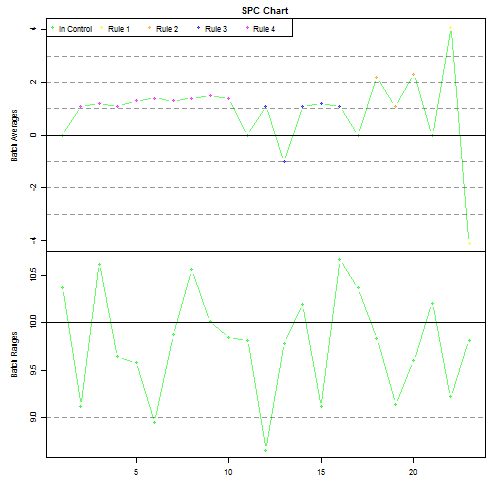

Package SPC - Identifies Statistical Process Control Violations
===============================================================

Statistical Process Control is a technique that classifies patterns
of variation according to standards.  To do this, it tracks the results
of batches processes.  Specifically, the values tracked include:
* The average value of a measurement from a batch process. 
* The ranges of values of a measurement from a batch process.

For example, suppose that a machine shop makes a batch of 100 shafts in a day.  The diameter of the shaft is critical, so the QA department would measure the diameter of each shaft.  The average of those diameters and the range of those diameters would be tracked for each day's output.  As the manufacturing process began to vary, this would (hopefullY) be made evident by changes in the average value and range of values.  

This simple technique can be very useful to detect changes in a process.  As tools wore out, this would show up as changes in either the average value or range of values, or both.  Environmental factors, such as temperature, could affect these results.  New operators, calibrations, and changes in raw materials could all affect these values.   

One standard that has been used since 1956 are the Western Electric Rules.  Before the rules can be presented, it is necessary to describe data zones used by the rules.

The Western Electric Rules classify data into zones.  These 
zones are defined as functions of the process mean and standard deviation.  The zones are:
* Zone C - within one standard deviation of the mean.
* Zone B - between one and two standard deviations of the mean.
* Zone A - more that two standard deviations from the mean.

The SPC package has a function (classifyByWesternElectricRuleZones) that classifies data into these zones.

Example:  classifyByWesternElectricRuleZones
--------------------------------------------


```r
library(SPC)
x = c(3.1, 3, 2.1, 2, 1.1, 1, 0.1, 0, -0.1, -1, -1.1, -2, -2.1, -3, -3.1)
x.bar = 0
sigma = 1
xclass = classifyByWesternElectricRuleZones(x, x.bar, sigma)
(xclass)
```

```
##  [1] "O" "A" "A" "B" "B" "C" "C" "C" "C" "C" "B" "B" "A" "A" "O"
```


Now that we have defined the zones, we can present the rules.
* Rule 1 - Any single data point falls outside the 3s limit from the centerline (i.e., any point that falls outside Zone A, beyond either the upper or lower control limit)
* Rule 2 - Two out of three consecutive points fall beyond the 2s limit (in zone A or beyond), on the same side of the centerline
* Rule 3 - Four out of five consecutive points fall beyond the 1s limit (in zone B or beyond), on the same side of the centerline
* Rule 4 - Eight consecutive points fall on the same side of the centerline (in zone C or beyond)

Since the rules require knowledge of which side of the centerline a datum lies, it is not sufficient to merely classify the data into zones A, B, or C, since those zones are defined on both sides of the mean.  So, I created a function that classifies the data with signs.  This is encapsulated in function classifyByWesternElectricRuleZones.numeric.

Example:  classifyByWesternElectricRuleZones.numeric
----------------------------------------------------


```r
library(SPC)
x = c(3.1, 3, 2.1, 2, 1.1, 1, 0.1, 0, -0.1, -1, -1.1, -2, -2.1, -3, -3.1)
x.bar = 0
sigma = 1
xclass = classifyByWesternElectricRuleZones.numeric(x, x.bar, sigma)
(xclass)
```

```
##  [1]  4  3  3  2  2  1  1  0 -1 -1 -2 -2 -3 -3 -4
```


With this classification function, it is this possible to look for patterns in the data.  This is done in function findWesternElectricRuleViolations.  Here is an example:

Example:  findWesternElectricRuleViolations
-------------------------------------------


```r
library(SPC)
x.bar = 0
sigma = 1
x = c(0, 1.1, 1.2, 1.1, 1.3, 1.4, 1.3, 1.4, 1.5, 1.4, 0, 1.1, -1, 1.1, 1.2, 
    1.1, 0, 2.2, 1.1, 2.3, 0, 4.1, -4.1)

results = findWesternElectricRuleViolations(x, x.bar, sigma)
(results)
```

```
##   idxInitial idxFinal rule
## 1          2       10    4
## 2         12       16    3
## 3         18       20    2
## 4         22       22    1
## 5         23       23    1
```

Colloquially, the SPC chart contains an 'X-bar' chart and a 'R' chart.  These depict the process average and process range for each batch produced.  This is implemented in function plotSpcChart. 

Example:  plotSpcChart
----------------------


```r
library(SPC)
batchAverages = c(0, 1.1, 1.2, 1.1, 1.3, 1.4, 1.3, 1.4, 1.5, 1.4, 0, 1.1, -1, 
    1.1, 1.2, 1.1, 0, 2.2, 1.1, 2.3, 0, 4.1, -4.1)
x.bar.batchAverages = 0
sigma.batchAverages = 1
batchRanges = numeric(length(batchAverages))
x.bar.batchRanges = 10
sigma.batchRanges = 1
for (i in 1:length(batchRanges)) {
    batchRanges[i] = x.bar.batchRanges + rnorm(1, 0, 0.5)
}
result = plotSpcChart(batchAverages, batchRanges, x.bar.batchAverages, sigma.batchAverages, 
    x.bar.batchRanges, sigma.batchRanges)
```

 

```r
(result)
```

```
##    batchAverage state.batchAverage batchRange state.batchRange
## 1           0.0                  0     10.374                0
## 2           1.1                  4      9.119                0
## 3           1.2                  4     10.619                0
## 4           1.1                  4      9.644                0
## 5           1.3                  4      9.583                0
## 6           1.4                  4      8.950                0
## 7           1.3                  4      9.875                0
## 8           1.4                  4     10.561                0
## 9           1.5                  4     10.015                0
## 10          1.4                  4      9.842                0
## 11          0.0                  0      9.817                0
## 12          1.1                  3      8.656                0
## 13         -1.0                  3      9.786                0
## 14          1.1                  3     10.192                0
## 15          1.2                  3      9.114                0
## 16          1.1                  3     10.668                0
## 17          0.0                  0     10.368                0
## 18          2.2                  2      9.830                0
## 19          1.1                  2      9.141                0
## 20          2.3                  2      9.601                0
## 21          0.0                  0     10.205                0
## 22          4.1                  1      9.218                0
## 23         -4.1                  1      9.815                0
```


In the above chart, green points are those that are in control.  Any points that are not green should be examined for a root cause analysis.

Note that these functions specify the mean and standard deviation as NULL values.  When these values are NULL, the function calculates the mean and standard deviation from the data.  However, a process owner may define these to other (typically tighter) values to detect violations sooner.

And as Bubba said to Forrest, that's about it!
