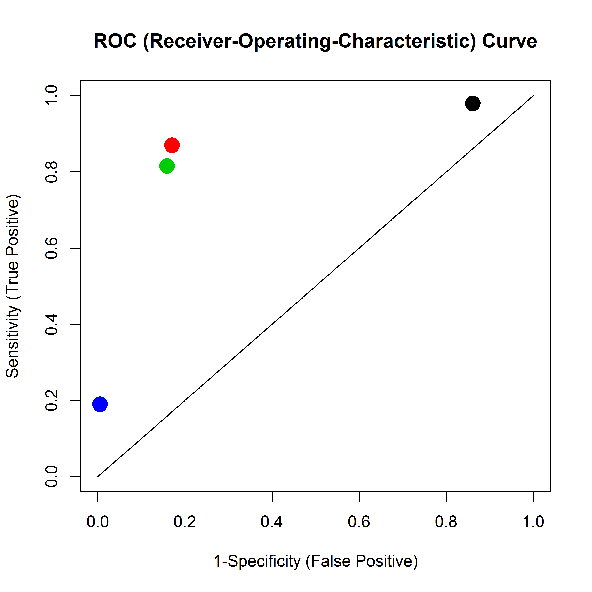

Lab 1 - April 9 2013
========================================================

<font color='blue'>**Assignment 1: Prove Bayes' Rule**</font>

$$\Pr\left(A \mid B\right) =  \Pr\left(B \mid A\right) \frac{\Pr(A)}{\Pr(B)}  $$

<font color='red'>**7 minutes**</font>

Hint: Use the definition of conditional probability, twice.

 - Reminder: the definition is $\Pr\left(A \mid B\right) =  \frac{\Pr(A \& B)}{\Pr(B)}$
 
 - I find it more useful to think of the definition this way: $\Pr(A \& B) =\Pr(A)\Pr\left(B \mid A\right)$
 
Solution
==========

$$\Pr\left(A \mid B\right) =   \frac{\Pr(A \& B)}{\Pr(B)} $$

$$ =  \frac{\Pr(A)\Pr\left(B \mid A\right)}{\Pr(B)} . $$

Done! (all that remains is to deceptively re-arrange terms)

So What's the big deal? In lieu of an answer, we move on to...

Assignment 2: Sensitivity, Specificity, Positive-Predictive Value
=============

View on Wikipedia (where else?)

Arguably, for 2-class classification, Sens/Spec/PPV are more appropriate performance scores than just the "flat" error rate.

They do necessitate, however, setting one class as a "background" or "NO" class, and the other as a "signal" or "YES" class.

<font color='blue'>**2a: express the theoretical sensitivity/specificity/PPV of a classifier, in terms of conditional probability. Use the labels "Yes","No", for the two classes, and "Test Positive", "Test Negative" for the classification decisions.**</font>

<font color='red'>**10 minutes**</font>

2a: Solutions
=================

$$Sensitivity = \Pr\left(\textrm{Test Positive | class="Yes"}\right)$$

$$Specificity = \Pr\left(\textrm{Test Negative | class="No"}\right)$$

$$PPV = \Pr\left(\textrm{class="Yes" | Test Positive}\right)$$

 - Suppose we know that the marginal (=overall) prevalence of *"Yes"* is $p$. Then a purely random "classifier" that chooses *"Yes"* with probability $p$, will have sensitivity $=p$ and a specificity $=1-p$. 
 - **Check it out!** Btw, what will the error rate be?
 - A "classifier" that always chooses the more prevalent class (assume for a moment it's the *"No"* class), will have sensitivity $=0$ and specificity $=1$.

Assignment 2b
=======
<font color='blue'>**For each of the following real results from StatR201 final projects, calculate the 'flat' error rate, sensitivity, specificity and PPV.**</font>

<font color='red'>**15 minutes.**</font> Data (here we follow the Wikipedia/etc. convention, placing the true situation in **columns**, with Column 1 = *"Yes"*):


```r
print(bob <- cbind(c(12729, 262), c(7013, 1135)))
```

```
##       [,1] [,2]
## [1,] 12729 7013
## [2,]   262 1135
```

```r
print(lipingRF <- cbind(c(839, 125), c(1131, 5519)))
```

```
##      [,1] [,2]
## [1,]  839 1131
## [2,]  125 5519
```

```r
print(lipingSVM <- cbind(c(786, 178), c(1055, 5595)))
```

```
##      [,1] [,2]
## [1,]  786 1055
## [2,]  178 5595
```

```r
print(sergio <- cbind(c(165, 704), c(87, 19955)))
```

```
##      [,1]  [,2]
## [1,]  165    87
## [2,]  704 19955
```


Tip: you might want to code a function

2b: Solutions
==============

```r
SenSpec<-function(tab) { # 2x2 table, truth in columns
yesno=colSums(tab)
classums=rowSums(tab)
return(c(sens=tab[1,1]/yesno[1],
      spec=tab[2,2]/yesno[2],
      ppv=tab[1,1]/classums[1],
      flaterr=1-sum(diag(tab))/sum(tab) ))  
}

round(bobs<-SenSpec(bob),3)
```

```
##    sens    spec     ppv flaterr 
##   0.980   0.139   0.645   0.344
```

```r
round(liping1s<-SenSpec(lipingRF),3)
```

```
##    sens    spec     ppv flaterr 
##   0.870   0.830   0.426   0.165
```

```r
round(liping2s<-SenSpec(lipingSVM),3)
```

```
##    sens    spec     ppv flaterr 
##   0.815   0.841   0.427   0.162
```

```r
round(sergios<-SenSpec(sergio),3)  
```

```
##    sens    spec     ppv flaterr 
##   0.190   0.996   0.655   0.038
```


2b: Visualizing the Solutions
==============
<blockquote  style="float:left;width: 50%;font-style: normal">


```r
curve(identity, xlab = "1-Specificity (False Positive)", ylab = "Sensitivity (True Positive)", 
    main = "ROC (Receiver-Operating-Characteristic) Curve")
points(1 - bobs["spec"], bobs["sens"], pch = 19, cex = 2)
points(1 - liping1s["spec"], liping1s["sens"], pch = 19, col = 2, cex = 2)
points(1 - liping2s["spec"], liping2s["sens"], pch = 19, col = 3, cex = 2)
points(1 - sergios["spec"], sergios["sens"], pch = 19, col = 4, cex = 2)
```

 


</blockquote>

<blockquote  style="float:right;width: 30%;font-style: normal">
 - The diagonal is a "futility boundary": a random "classifier" can achieve this performance, as we've seen a few minutes ago.
 - Questions?
</blockquote>

Assignment 3: Sensitivity, Specificity and Bayes' Rule
======================

Someone you know undergoes a test for a rare disease. They test positive, but get a confusing message from their physician. They ask you -- their "Numbers" friend -- to help figure out how bad this could be.

You look up the test, and see that it has a sensitivity of $95\%$, and specificity of $99\%$. The prevalence of this disease in the population is $0.01\%$, and your friend belongs to no known risk group.

<font color='blue'>**Given that your friend tested positive, what is the probability that s/he really has the disease? Solve formally using probabilities and Bayes' Rule.**</font>

<font color='red'>**20 minutes**</font>

If you finished early, suggest a strategy to improve the diagnostic ability of this test. 

Assignment 3 Solution
==========

Let's call $A$ the event of having the disease, and $B$ the event of testing positive. Then:

$$\Pr\left(A \mid B\right) = \frac{\Pr(A)\Pr\left(B \mid A\right)}{\Pr(B)} = \frac{0.0001\times 0.95}{\Pr(B)}. $$

The only thing we need to sweat a little bit for is $\Pr(B)$, the marginal probability of testing positive. We find it by complete enumeration, a.k.a. **The Law of Total Probability:**

$$\Pr(B)=\Pr(A)\Pr\left(B \mid A\right)+\Pr(\overline{A})\Pr\left(B \mid \overline{A}\right)= 0.0001\times 0.95 + 0.9999\times 0.01.$$


```r
0.95 * 1e-04 + 0.01 * 0.9999
```

```
## [1] 0.01009
```

```r
# And now the final answer:
0.95 * 1e-04/(0.95 * 1e-04 + 0.01 * 0.9999)
```

```
## [1] 0.009412
```


**Even after testing positive, your friend has $<1\%$ chance of actually being sick!**

Ok, the sentence above describes the numbers. But does it adequately describes the reality? Of course not. The person is either sick (in the sense of having enough real aspects of the disease to be captured by a proper test), or is not (i.e., a false positive). **Deterministically.**

<font color='red'>So the word "chance" in the statement above, describes a **subjective** probability. Which is the type of probabilty that Bayesian methods assume.</font>

Assignment 3 Follow-Up
=======================

 1. You did realize that all we calculated was the PPV (positive predictive value), right?
 2. So... what would you do to make this test more workable? How about the physician telling your friend that s/he "needs further testing", rather than that they tested positive?
 3. Ok, we go for a 2nd test. Suppose the result is positive again. What's the PPV now? Do we have to calculate from scratch? Heck no. We just do
 
$$\Pr\left(A \mid B_1,B_2\right) = \frac{\Pr(A\mid B_1)\Pr\left(B_2 \mid A,B_1\right)}{\Pr(B_2 \mid B_1)}. $$

 - In other words, we take the results of Assignment 3 and pipe them back into "the input side" of Bayes' Rule. **You only need to change one number!** *How much would the result be now?* (5 minutes)
 
 - In Bayesian statistics, this is known as **Updating the Posterior.** Note that this exercise is not Bayesian *per se*, but is an application of Bayes' Rule and updating in a context which both Bayesian and frequentist statistics would approach in the same manner.
 - From an updating perspective, Bayes' Rule is best written as
 
 $$\Pr\left(A \mid B\right) =  \Pr(A) \frac{\Pr\left(B \mid A\right)}{\Pr(B)}.  $$
 
- <font color='blue'>**Our view of $A$ changes after observing $B$, as a function of how strongly it is associated with $B$. if $A$ and $B$ are independent it will not change at all, because then $\Pr\left(B \mid A\right)=\Pr(B)$.**</font>
 
